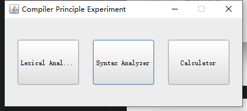
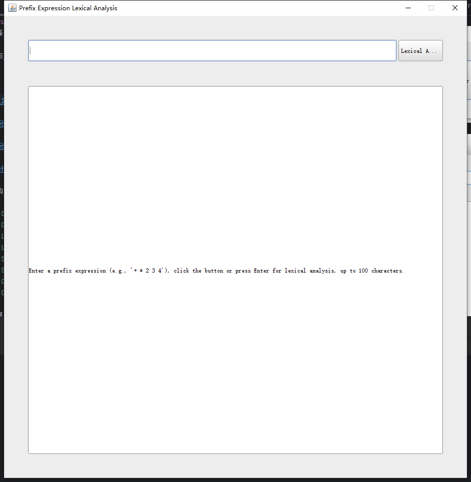
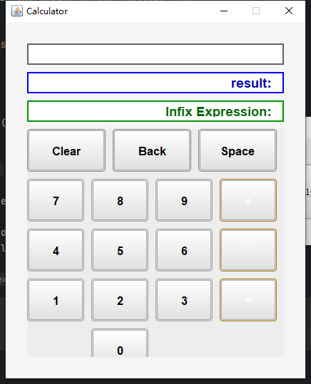
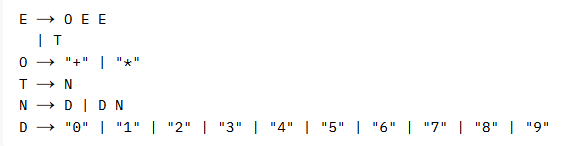

# Calculator
A simple calculator based on the knowledge of lexical analysis, syntax analysis, semantic calculation, etc. learned from compilation principles.

Demo ：

File structure description:

- Calculator - main class
- CalculatorFrame - general interface
- LexDFAFrame - lexical analyzer interface
- LexDFA - lexical analysis implementation
- SyntaxFrame - syntax analyzer interface
- Syntax - syntax analysis implementation
- CalcFrame - calculator interface
- Calc - calculator implementation with semantic calculation

This project is based on the following grammarG[E]：

how to run:
Enter main class"Calculator" and  RUN

